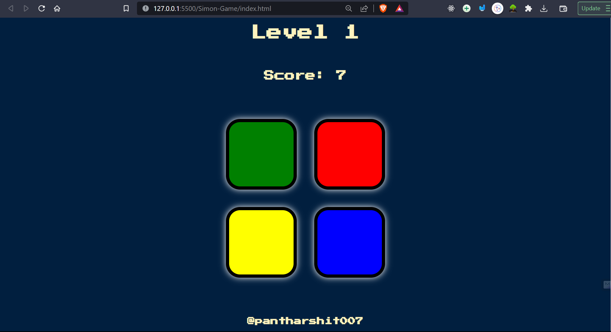

# Simon Game

Simon Game is a browser-based game where players need to memorize and repeat a sequence of colors. Test your memory and see how far you can go!

## How to Play

1. Press any key to start the game.
2. Pay attention to the sequence of colors shown on the screen.
3. Click on the buttons to repeat the sequence.
4. Each successful repetition increases your score and advances you to the next level.
5. Be careful! Making a mistake will end the game.
6. Press any key to restart and try again.

## Technologies Used

- HTML
- CSS
- JavaScript
- jQuery

## Features

- Randomly generated color sequences for each level.
- Sound effects to enhance the gaming experience.
- Responsive design for different screen sizes.
- Keeps track of the highest level reached.

## Getting Started-I

To play the Simon Game, simply open the `index.html` file in your web browser,
or click [here](https://simon-game007.onrender.com/).

## Getting Started-II

To play the Simon Game, follow these steps:
1. Clone the repository: `git clone https://github.com/pantharshit007/Simon-Game.git`
2. Open the `index.html` file in your preferred web browser.
3. Press any key to start the game and begin testing your memory skills.
4. Follow the on-screen instructions to play and enjoy the game.

## Preview

## Credits

- The Simon Game concept is based on the popular electronic game "Simon" created by Ralph H. Baer and Howard J. Morrison.
- Sound effects obtained from [SoundBible](https://www.soundbible.com/).

## Author

Harshit Pant || [@pantharshit007](https://github.com/pantharshit007)

